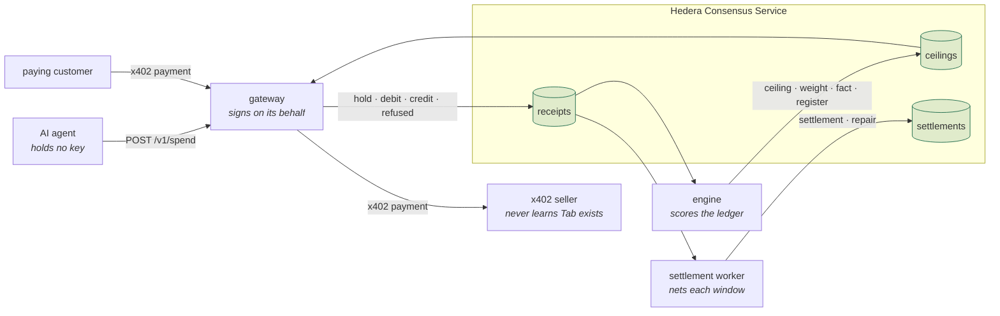
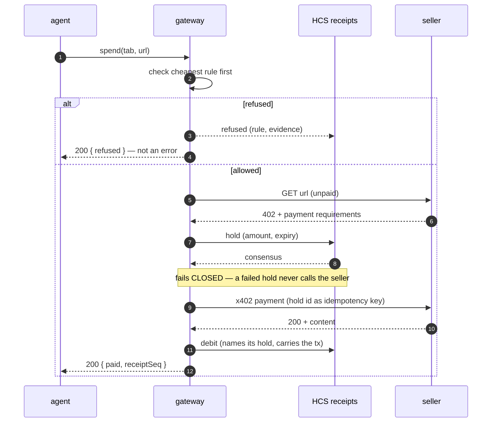
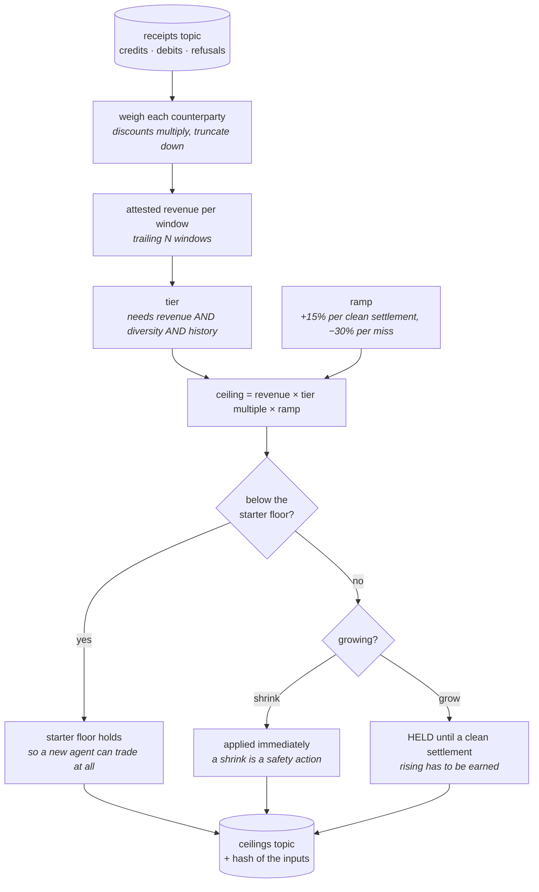

# Tab — monorepo

**Agents shouldn't need a wallet to do business.**

The product argument, the pitch, and the demo script live in **[README-TAB.md](README-TAB.md)**.
This file is the map of the repository.

Built for ETHOnline 2026 · Hedera Testnet · **Zero Solidity**

---

## Start here

| If you are… | Read |
|---|---|
| new to the project | [README-TAB.md](README-TAB.md), then [docs/ARCHITECTURE.md](docs/ARCHITECTURE.md) |
| about to write code | [docs/RESEARCH.md](docs/RESEARCH.md) — six findings change what several packages do |
| picking up a package | [docs/PACKAGE_MAP.md](docs/PACKAGE_MAP.md), then that package's own README |
| wondering why something is shaped oddly | [docs/adr/](docs/adr/) |
| setting up | [docs/ENVIRONMENT.md](docs/ENVIRONMENT.md) |
| splitting the work | [docs/BUILD_ORDER.md](docs/BUILD_ORDER.md) |
| sitting down to work, any day | **[HANDOFF.md](HANDOFF.md)** — the living log. Read it first, update it before you push |

## How it fits together

Four processes, three HCS topics, and one rule: nothing is stored that is not
derived from a message a stranger can replay.



### A spend, in order

The hold is published and **awaited to consensus before the seller is called**.
That costs 2–4 seconds and buys the one property a stranger cannot otherwise
check: every debit traces to an authorisation that preceded it.



### Where a credit limit comes from

The ceiling is never typed. It is computed from settled revenue, discounted by
how independent that revenue is, and published with a hash of its own inputs so
anyone can recompute it.



---

## Layout

```
apps/          deployable processes — gateway, engine, settlement, cli, web
packages/      libraries, in dependency tiers. Three are published to npm
agents/        demo actors — honest-agent, loop-attacker
tools/         probes, bootstrap, verify, guards
docs/          architecture, ADRs, research, probes, keys
HANDOFF.md        living log — updated on every change
infra/         managed-service setup. No Docker
boundaries.json   THE ARCHITECTURE, machine-checked in CI
```

Every directory has a README stating what belongs in it, what must never go in it, its dependency
rules, and its invariants. Those READMEs are the specification — start from the one for the package
you own.

## The rules that are enforced, not just documented

`boundaries.json` declares each package's allowed dependencies. `pnpm guard` fails CI on violation.
Five bans, each protecting a claim in [README-TAB.md](README-TAB.md):

| Ban | Protects |
|---|---|
| the fast path cannot reach Mirror Node, Postgres or the scoring code | the sub-50ms budget |
| `tools/verify` cannot reach Postgres or Redis | "a stranger can recompute a ceiling" — the no-contract argument |
| `honest-agent` cannot import the Hedera SDK | "the agent holds no key and signs nothing" |
| no `.sol` file, no EVM tooling | the No Solidity Allowed track |
| no floating-point arithmetic in money paths | "reconciles to the cent" |

A rule in prose survives until the first tired commit. See [tools/guards/](tools/guards/).

## Commands

```bash
pnpm install
cp .env.example .env

pnpm probe          # Phase 0 — run FIRST. Nothing else starts until it is green
pnpm db:migrate     # Supabase schema
pnpm bootstrap      # create HCS topics + float accounts, associate USDC

pnpm dev:web        # the three surfaces on :3000 — works today, no backend needed
pnpm dev            # gateway + engine + settlement + web
pnpm guard          # the architectural bans
pnpm test

pnpm demo:honest    # 40 paid calls from an agent with no wallet
pnpm demo:attack    # the loop attacker, refused mid-window
pnpm verify-tab     # replay HCS, assert the float invariant
pnpm verify-ceiling --seq 42
```

## Stack

Verified against the live npm registry on 2026-08-18 — see [docs/RESEARCH.md](docs/RESEARCH.md) for
why each choice, and which of them corrects [README-TAB.md](README-TAB.md).

| | |
|---|---|
| Chain | Hedera Testnet — HCS, HTS, Schedule Service (HIP-423), Mirror Node |
| SDK | **`@hiero-ledger/sdk` 2.87.0** — never `@hashgraph/sdk` |
| Payments | **`@x402/core` + `@x402/hedera` 2.22.0** on `hedera:testnet` |
| Agent surface | **`@hashgraph/hedera-agent-kit` 4.1.0** — plugin + policy |
| Backend | Node 22, TypeScript strict, Fastify, BullMQ, Drizzle |
| Frontend | **Next.js 16.3.1**, React 19, Tailwind v4, three.js. All three surfaces in `apps/web` |
| Infra | Supabase (Postgres) + Upstash (Redis). **No Docker** |
| Tooling | pnpm workspaces, Turborepo, Biome, Vitest, changesets |
| Not used | Solidity, Foundry, Hardhat, any EVM tooling |

## Status

**Frontend built. Backend not started.**

- **`apps/web` runs** — landing, operator console (8 views) and docs, all three surfaces, every
  figure from `apps/web/src/lib/mock/`. `pnpm dev:web` → http://localhost:3000
- **Everything else is structure and READMEs.** Phase 0 probes are the next action for the backend —
  see [docs/probes.md](docs/probes.md). The frontend does not wait on them.

Design direction and the reasoning behind it: [docs/DESIGN_PROMPT.md](docs/DESIGN_PROMPT.md).
Current state and who is on what: **[HANDOFF.md](HANDOFF.md)**.
